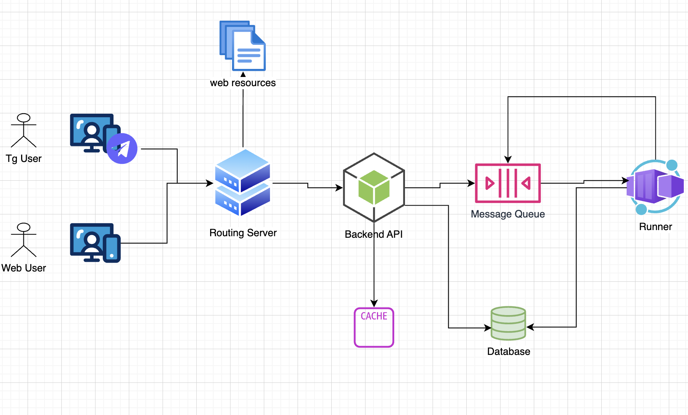

# Auctionus - Архитектура системы

## Обзор

Auctionus - это система для проведения многораундовых онлайн-аукционов. Лоты представлены в виде строк данных.

## Что мы нашли в аналоге Auctionus - Telegram Gift Auctions

- Аукционы проводятся в несколько раундов.
- В каждом раунде может разыгрываться несколько предметов.
- Антиснайпинг - при ставке близкой к концу аукциона, аукцион продлевается.
- Можно повысить свою ставку не зависимо от твоего места и не дожидаясь каких либо условий.
- При окончании раунда:
  - Предметы этого раунда отдаются за самые большие ставки (Предмет ID-1 отдается топ-1 ставке, предмет ID-2 отдается топ-2 ставке и тд)
  - Когда предметы заканчиваются ставки переносятся в следующий раунд.
  - Если это последний раунд, ставки, не выигравшие предметы, считаются проигравшими и возвращаются владельцам.

## System Diagram


## Технологический стек

- **Framework**: NestJS (Требование)
- **Authentication**: JWT + Telegram / Password
  - Не нужно реализовывать регистрацию
- **Database**: MongoDB - Mongoose (Требование)
- **Cache/Locks**: Redis
  - Нужен простой кэш по ключу
  - Нужна возможность создавать lock-и
- **Message Queue**: RabbitMQ
  - Нам нужна возможность отправлять отложенные сообщения для начала обработки аукциона к определенному времени


## Схема данных
[Схема данных](./docs/MODELS.md)

## Как работает система?

- Предметы и аукционы создаются в базе заблаговременно скриптами / руками. При создании также прокидывается отложенное сообщение в RabbitMQ с временем окончания аукциона.
  - Предметы представляют собой структуру, содержащую поле value - которое и является разыгрываемым лотом. В рамках системы это рандомные строки.
  - Можно указать для аукциона:
    - минимальная ставка
    - минимальная разница в ставках
    - anti-sniping (в том числе сколько минут прибавляется)
    - время конца (относительное / абсолютное)
- Пользователь авторизуется через Telegram Mini Apps (InitData) и получают уже авторизационный токен нашей системы.
  - Регистрация не нужна, реализуется на уровне телеграма
  - У пользователя есть кошелек с внутренней валютой. Далее - Токены.
  - Токены хранятся в виде интов для правильного подсчета денег. При работе с реальными деньгами можно добавить отдельное поле для позиции дробной части, если токены будут стоить очень много, но в рамках этой системы нам это не понадобилось.
  - Все операции с деньгами должны добавлять запись в коллекцию transactions.
- Пользователь получает список аукционов и выбирает интересующий его.
- Пользователи ставят ставки токенами до окончания аукциона с блокировкой аукциона.
- При окончании раунда сообщение попадает в очередь, которую слушает раннер.
- Ранер получает сообщение, фиксирует окончание раунда аукциона и начинает поэтапную обработку раунда с разделением этапов по доменам / данным:
  - DETERMINE_WINNERS
  - TRANSFER_ITEMS
  - PROCESS_PAYMENTS
  - REFUND_LOSERS
  - FINALIZE
- Поэтапная обработка сделана для уменьшения времени локов и транзакций.


## Проверка системы:

- Написаны тесты:
  - интеграционные для проверки валидности логики
  - e2e для проверки совместимости всех компонентов системы
  - Нагрузочные тесты для проверки конкурентности.

- Как запустить весь проект:

1. Перейти в папку backend:
```bash
cd backend
```

2. Запустить Docker Desktop, затем поднять backend:
```bash
docker compose --profile server up -d --build
```

3. Перейти в папку frontend и запустить:
```bash
cd ../frontend
npm run build
npm run dev
```

4. В **отдельном терминале** запустить cloudflare туннель:
```bash
cloudflared tunnel --url http://localhost:5173
```

5. Взять URL из вывода команды выше (например `https://chambers-editorials-potato-font.trycloudflare.com`) и в **другом терминале** отправить сообщение боту (предварительно подготовив токен своего бота из Telegram):
```bash
curl -X POST "https://api.telegram.org/bot<token бота>/sendMessage" \
  -H "Content-Type: application/json" \
  -d '{
    "chat_id": "<id из @Getmyid_bot>",
    "text": "Open app",
    "reply_markup": {
      "inline_keyboard": [[{ "text": "Open", "web_app": { "url": "<url из cloudflare туннеля, с https>" } }]]
    }
  }'
```
6. Поменять значения в frontend\vite.config.ts на строках 8 и 11, без https:// на этот раз. Сохранить файл

7. Открыть сообщение "Open App" от своего бота в Telegram.

8. В VSCode открыть репозиторий Backend, нажать `Ctrl+Shift+P` → "Tasks: Run Task" и по очереди выполнить:
   - **Scripts: Create user + wallet** (нужен id чата Telegram, можно взять из @Getmyid_bot)
   - **Scripts: Top up wallet (interactive)** (аналогично)
   - **Scripts: Stress test auction (2 min + users + bids)**

9. Открыть TG Mini App и делать ставки!

- VSCode Tasks:
  - Scripts: Create user + wallet: Интерактивное создание пользователя
  - Scripts: Create auction + items: Интерактивное создание аукциона

- Swagger: **localhost:3000/api/docs**
  - В Swagger лучше авторизовываться через пароль, положив полученный access токен в окно авторизации.

- TG Bot: **link**


